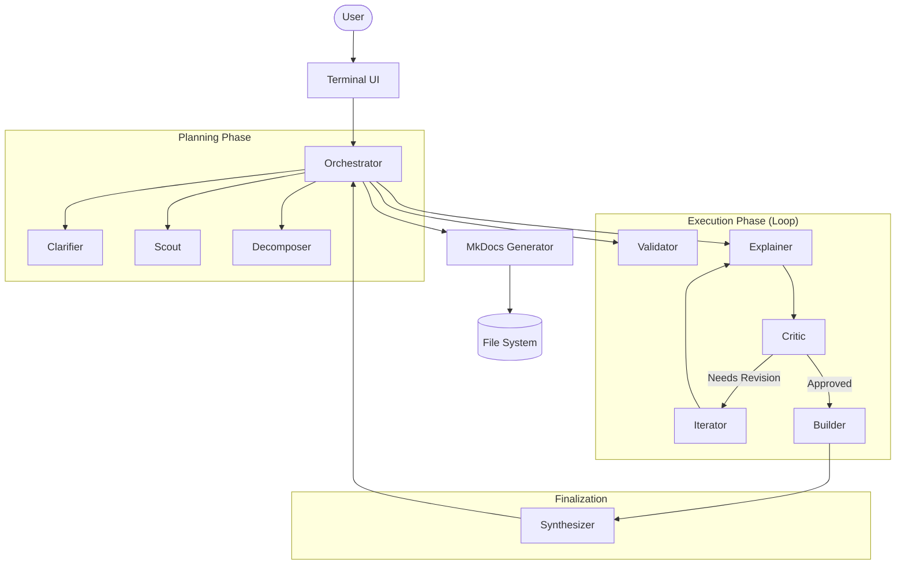

# Architecture Documentation

## Overview

**Explain It** is designed as a modular, event-driven multi-agent system. The core design philosophy is "Separation of Concerns" applied to LLM tasks. Instead of one giant prompt doing everything, we have 10 specialized agents coordinated by a central Orchestrator.

## High-Level Diagram

## Core Components

### 1. Orchestrator (`src/core/orchestrator.ts`)
The central brain. It maintains the `StateManager`, listens to the `EventSystem`, and routes tasks to the appropriate agents. It does not "think" about the content, only about the process.

### 2. State Manager (`src/core/state.ts`)
Persists the current workflow state to `state.json`. This allows the system to recover from crashes or pause/resume (future feature).

### 3. Circuit Breaker (`src/core/circuit-breaker.ts`)
Prevents infinite loops. If the Critic rejects an explanation too many times, or if detailed validation fails repeatedly, the Circuit Breaker trips and forces a fallback strategy (e.g., simplifying the scope).

## Agents (`src/agents/`)

| Agent | Responsibility | Input | Output |
|-------|----------------|-------|--------|
| **Clarifier** | Disambiguates user queries. | User Query | Clarified Topic / Questions |
| **Scout** | Researches the topic to gather context. | Topic | Context / Resources |
| **Decomposer** | Breaks topic into a learning path. | Topic + Context | Plan (List of Concepts) |
| **Validator** | Sanity checks the plan. | Plan | Valid/Invalid + Feedback |
| **Explainer** | Explains a single concept. | Concept | Draft Explanation |
| **Critic** | Reviews the draft (Feynman test). | Draft | Score + Feedback |
| **Iterator** | Refines draft based on feedback. | Draft + Feedback | Improved Draft |
| **Re-Decomposer** | Adjusts plan if execution fails. | Current State | New Plan |
| **Builder** | Assembles approved concepts. | Explanations | Full Markdown Draft |
| **Synthesizer** | Polishes and formats final output. | Markdown Draft | Final Document |

## Technology Stack

- **Runtime**: Node.js (ESM)
- **Language**: TypeScript
- **UI**: Ink (React for CLI)
- **LLM**: Anthropic Claude (via SDK)
- **Output**: Markdown + MkDocs
