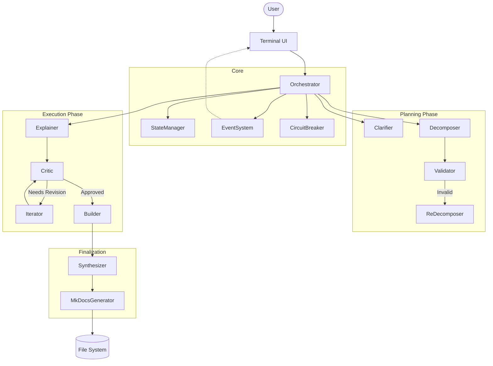

# Architecture Documentation

## Overview

**Explain It** is a modular, event-driven multi-agent system. The core design philosophy is "Separation of Concerns" applied to LLM tasks. Instead of one monolithic prompt, the system uses 10 specialized agents coordinated by a central Orchestrator.

## Directory Structure

```
src/
├── index.ts                    # Entry point (Ink React app)
├── agents/                     # AI agent implementations
│   ├── clarifier.ts           # Clarifies ambiguous user queries
│   ├── decomposer.ts          # Breaks down topics into concepts
│   ├── explainer.ts           # Generates concept explanations
│   ├── critic.ts              # Validates explanation quality
│   ├── iterator.ts            # Iteratively improves explanations
│   ├── validator.ts           # Validates decompositions
│   ├── redecomposer.ts        # Re-decomposes when validation fails
│   ├── builder.ts             # Generates implementation guides
│   ├── synthesizer.ts         # Generates final documentation
│   └── similarity.ts          # Detects duplicate concepts
├── core/
│   ├── orchestrator.ts        # Main workflow orchestrator
│   ├── state.ts               # State management (WorkflowState)
│   ├── types.ts               # Core data structures
│   ├── events.ts              # Typed event emitter system
│   ├── circuit-breaker.ts     # Failure/retry logic
│   ├── agent/
│   │   └── base-agent.ts      # Abstract base for all agents
│   ├── llm/
│   │   ├── client.ts          # LLM client interface
│   │   ├── claude-client.ts   # Claude API implementation
│   │   ├── chat-retry-handler.ts  # Retry with exponential backoff
│   │   ├── response-parser.ts # JSON response parsing
│   │   └── template-renderer.ts   # Prompt template rendering
│   └── prompt/
│       └── prompt-manager.ts  # Loads and manages prompt templates
├── config/
│   ├── config.ts              # Application configuration
│   └── env.ts                 # Environment variables
├── generator/
│   ├── mkdocs-generator.ts    # MkDocs scaffolding and generation
│   └── template-manager.ts    # Handlebars template rendering
├── tui/                       # Terminal UI (Ink/React)
│   ├── App.tsx                # Main app component
│   ├── InputScreen.tsx        # Query & depth input
│   ├── ProgressScreen.tsx     # Real-time progress display
│   ├── ClarificationScreen.tsx # User clarification prompts
│   ├── OutputScreen.tsx       # Results display
│   └── ErrorScreen.tsx        # Error handling
├── templates/
│   ├── concept-page.md        # Handlebars template for concept pages
│   └── prompts/claude/        # Claude-specific prompt templates
│       ├── clarifier.md
│       ├── decomposer.md
│       ├── explainer.md
│       ├── critic.md
│       ├── iterator.md
│       ├── builder.md
│       ├── synthesizer.md
│       ├── validator.md
│       ├── redecomposer.md
│       └── similarity.md
├── utils/
│   └── logger.ts              # Logging utility
└── test/
    └── agents/
        └── integration.test.ts # Agent integration tests
```

## High-Level Diagram



## Core Components

### Orchestrator (`src/core/orchestrator.ts`)

The central workflow controller. It:
- Manages the entire processing pipeline
- Coordinates agent execution in sequence
- Handles state persistence
- Manages user input/clarification flow
- Emits events for TUI updates

The Orchestrator does not "think" about content, only about process.

### StateManager (`src/core/state.ts`)

Persists and manages workflow state with:
- `WorkflowPhase` enum: `clarify` → `scout` → `decompose` → `validate` → `explain` → `build` → `synthesize` → `complete`
- Explanations database
- Concept tracking and failure records
- JSON serialization to disk for recovery

### EventSystem (`src/core/events.ts`)

Strongly-typed event emitter that decouples the Orchestrator from the TUI:

| Event | Description |
|-------|-------------|
| `phase_start` | Workflow phase transitions |
| `step_progress` | Progress messages |
| `node_discovered` | New concept discovery |
| `node_status_update` | Concept status changes (pending/in-progress/done/failed) |
| `request_input` | User input requests |
| `error` | Error events |

### CircuitBreaker (`src/core/circuit-breaker.ts`)

Prevents infinite loops. If the Critic rejects an explanation too many times, or if validation fails repeatedly, the CircuitBreaker trips and forces a fallback strategy.

## Agent System

### BaseAgent (`src/core/agent/base-agent.ts`)

Abstract base class providing:
- LLM client integration
- Template rendering via Handlebars
- Response parsing with retry logic
- JSON parsing with error handling
- Methods: `executeLLM()`, `executeConversation()`, `executeLLMWithTemplate()`

### Agents

| Agent | Responsibility | Input | Output |
|-------|----------------|-------|--------|
| **Clarifier** | Disambiguates user queries | User Query | Clarified Topic / Questions |
| **Decomposer** | Breaks topic into a learning path | Topic + Context | Plan (List of Concepts) |
| **Validator** | Sanity checks the decomposition | Plan | Valid/Invalid + Feedback |
| **Explainer** | Explains a single concept | Concept | Draft Explanation |
| **Critic** | Reviews draft (Feynman test) | Draft | Score + Feedback |
| **Iterator** | Refines draft based on feedback | Draft + Feedback | Improved Draft |
| **ReDecomposer** | Adjusts plan if validation fails | Current State | New Plan |
| **Builder** | Assembles approved concepts | Explanations | Implementation Guide |
| **Synthesizer** | Compiles final output | All Content | MkDocs Structure |
| **Similarity** | Detects semantic duplicates | Concept List | Duplicate Groups |

## Data Flow

```
User Input (TUI)
    │
    ▼
┌─────────────────┐
│  CLARIFY Phase  │  ClarifierAgent: resolve ambiguity, suggest depth
└────────┬────────┘
         ▼
┌─────────────────┐
│  SCOUT Phase    │  ExplainerAgent: create root explanation
│                 │  CriticAgent: validate quality (loop)
└────────┬────────┘
         ▼
┌─────────────────┐
│ DECOMPOSE Phase │  DecomposerAgent: break into sub-concepts
│                 │  ValidatorAgent: check decomposition
│                 │  ReDecomposerAgent: fix if needed
└────────┬────────┘
         ▼
┌─────────────────┐
│ EXPLAIN Phase   │  For each concept (recursive):
│                 │    ExplainerAgent → CriticAgent loop
│                 │    MkDocsGenerator: write concept page
└────────┬────────┘
         ▼
┌─────────────────┐
│  BUILD Phase    │  BuilderAgent: generate implementation guide
└────────┬────────┘
         ▼
┌─────────────────┐
│SYNTHESIZE Phase │  SynthesizerAgent: compile index + navigation
│                 │  MkDocsGenerator: write mkdocs.yml
└────────┬────────┘
         ▼
┌─────────────────┐
│ COMPLETE Phase  │  Output MkDocs site ready to serve
└─────────────────┘
```

## Key Data Structures (`src/core/types.ts`)

### Topic
User query and clarification results.

### Explanation
Rich concept explanation containing:
- Simple explanation & elevator pitch
- Analogy, scenario, diagram (Mermaid), code example
- "Why it exists" narrative (before/pain/after)
- References (official, tutorial, quick-ref, deep-dive)
- Check-understanding questions
- Complexity level & prerequisites

### Decomposition
Concept breakdown with:
- Concepts array (flat list)
- Learning sequence (ordered IDs)
- Scope tracking (in/out)
- Self-reflection score

### ConceptNode
Tree structure with:
- id, name, oneLiner
- Status (pending/in-progress/done/failed)
- Parent-child relationships
- Explanation attachment
- Relative file path

## LLM Integration

### Claude Client (`src/core/llm/claude-client.ts`)

- **Provider**: Anthropic Claude API
- **Model Strategy**: Haiku (fast/cheap) for most tasks, Sonnet/Opus for complex reasoning
- **Temperature**: Per-agent configuration (clarifier 0.3, explainer 0.7, etc.)
- **Features**: Thinking blocks, token tracking, web search capability

### Retry Handler (`src/core/llm/chat-retry-handler.ts`)

- Exponential backoff (1s, 2s, 4s...)
- Max 3 retries (configurable)
- Failure logging to JSONL

### Template Renderer (`src/core/llm/template-renderer.ts`)

- Handlebars-based prompt rendering
- Templates stored in `src/templates/prompts/claude/`
- Supports multi-provider architecture

## TUI (Terminal UI)

Built with **Ink** (React for the terminal):

| Screen | Purpose |
|--------|---------|
| `InputScreen` | Query and depth input |
| `ProgressScreen` | Real-time progress with concept tree |
| `ClarificationScreen` | User clarification prompts |
| `OutputScreen` | Final results display |
| `ErrorScreen` | Error handling |

The TUI subscribes to EventSystem events and updates React state accordingly.

## Output Generation

### MkDocsGenerator (`src/generator/mkdocs-generator.ts`)

- Scaffolds MkDocs project structure
- Writes concept pages to `docs/`
- Generates `mkdocs.yml` with navigation

### TemplateManager (`src/generator/template-manager.ts`)

- Renders Handlebars templates for concept pages
- Uses `src/templates/concept-page.md` as the base template

### Output Structure

```
output/<topic>/
├── docs/
│   ├── index.md          # Overview page
│   ├── 1_concept.md      # First concept
│   ├── 1_1_subconcept.md # Nested concept
│   └── assets/           # Images, diagrams
├── mkdocs.yml            # Auto-generated configuration
└── state.json            # Workflow state for debugging
```

## Technology Stack

| Category | Technology |
|----------|------------|
| Runtime | Node.js (ES modules) |
| Language | TypeScript |
| TUI | Ink (React for CLI) |
| LLM | Anthropic Claude SDK |
| Templating | Handlebars |
| Output | MkDocs + Material theme |
| Linting | Biome |
| Testing | Vitest |
| Schema Validation | Zod |

## Design Principles

1. **Modular Agents**: Each workflow step has a dedicated agent with specific responsibility
2. **Event-Driven**: Orchestrator and TUI are decoupled via typed events
3. **Recursive Decomposition**: Concepts are processed depth-first with cycle detection
4. **Quality Gates**: Critic validates every explanation; Validator checks decompositions
5. **Template-Based Prompts**: Prompts are separated from code for maintainability
6. **State Persistence**: Enables debugging and future resume capability
7. **Per-Agent Configuration**: Different models/temperatures for different tasks
